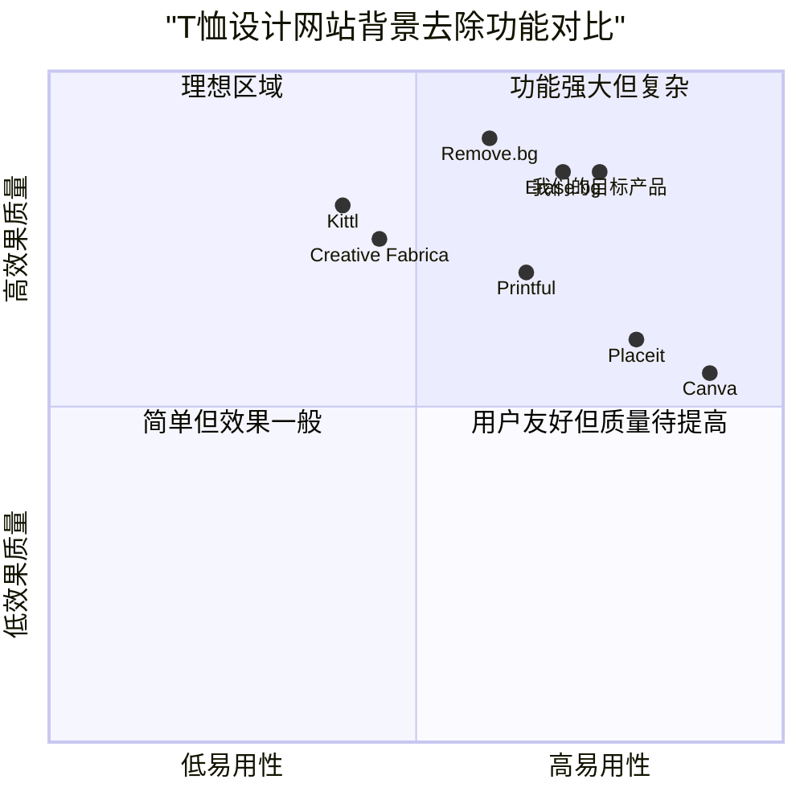

# 产品需求文档：AI设计T恤网站图像背景去除功能

## 项目信息
- **项目名称**: ai_tshirt_background_removal
- **文档版本**: 1.0
- **日期**: 2024-02-28

## 原需求描述
在AI设计T恤网站（https://aidesigntee.com/）上增加对设计图的抠图功能，把通过OpenAI接口设计的图像抠出背景后，生成无背景的图像后印制到T恤上，以达到更美观的效果。需要开发一个快速抠图工具，嵌入到网页代码中，在线实现抠图功能。

## 1. 产品定义

### 1.1 产品目标
1. **提升设计效果**: 通过去除图像背景，使T恤上的设计更加突出、美观，呈现更专业的印制效果
2. **增强用户体验**: 简化用户流程，自动处理图像背景问题，减少用户对图像处理的担忧
3. **技术创新**: 在网页端实现高质量的智能抠图功能，展示网站的技术领先性

### 1.2 用户故事
1. **作为一名无设计经验的用户**，我希望能自动去除AI生成图片的背景，这样我可以得到更专业的T恤印制效果，而不需要担心图片处理问题
2. **作为一名创意设计师**，我想要确保我设计的图案能够完美呈现在T恤上，需要能够精确识别和保留复杂图案的细节（如发丝、羽毛等）
3. **作为一名重复购买者**，我希望能够对已生成的图片进行背景调整，以便尝试不同风格的设计效果
4. **作为一名网站管理员**，我需要确保背景去除功能能够高效处理大量的请求，不会影响网站整体性能

### 1.3 竞品分析

| 竞品名称 | 优势 | 劣势 |
|--------|------|------|
| **Printful的设计工具** | 免费的背景去除；与印制流程集成；可自动提高图像质量 | 必须有账户才能下载；用户界面较为复杂 |
| **Erase.bg** | 专业的背景去除；处理速度快；API简单易用 | 高质量处理需要付费；无法直接集成到T恤设计流程 |
| **Remove.bg** | 处理质量高；API文档完善；支持批处理 | 价格相对较高；免费版有水印和限制 |
| **Kittl** | 背景去除和矢量化功能；创意设计工具全面 | 订阅模式成本较高；学习曲线陡峭 |
| **Creative Fabrica** | 丰富的设计资源库；背景去除工具性能稳定 | 界面繁琐；主要面向专业设计师 |
| **Placeit** | 直观的用户界面；丰富的模板库 | 背景去除不是核心功能；定制化选项有限 |
| **Canva** | 易于使用的界面；广泛的模板选择 | 背景去除功能是PRO版本；精细度不够专业 |

### 1.4 竞争象限图




## 2. 技术规格

### 2.1 需求分析

背景去除功能主要涉及以下核心技术需求：

1. **图像处理能力**：能够精确识别并去除图像背景，尤其是处理复杂边缘（如头发、毛发、羽毛等）
2. **客户端处理**：在用户浏览器中进行处理，避免过多的服务器压力，提高响应速度
3. **性能优化**：确保在各种设备上有良好的运行性能，尤其是移动设备
4. **与现有流程集成**：无缝融入当前的AI设计和T恤定制流程
5. **安全性**：确保用户图像数据处理安全，尊重隐私

### 2.2 需求池

| ID | 需求描述 | 优先级 | 复杂度 |
|----|--------|-------|-------|
| BG001 | 自动识别并去除通过OpenAI API生成的图像背景 | P0 | 高 |
| BG002 | 支持透明背景（PNG格式）图像输出 | P0 | 中 |
| BG003 | 提供背景去除预览功能 | P0 | 中 |
| BG004 | 在浏览器端实现背景去除，减少服务器负载 | P0 | 高 |
| BG005 | 提供背景去除质量调整选项（精细度滑块） | P1 | 中 |
| BG006 | 支持对已保存设计的背景去除功能 | P1 | 中 |
| BG007 | 自动优化去除背景后的图像质量，确保印制效果 | P1 | 高 |
| BG008 | 提供手动调整功能，允许用户微调自动抠图结果 | P2 | 高 |
| BG009 | 支持不同设备和浏览器（响应式设计） | P0 | 中 |
| BG010 | 对处理失败的情况提供友好的错误提示和替代方案 | P1 | 低 |

### 2.3 UI设计草图

#### 2.3.1 背景去除功能集成位置

在当前AI设计流程中的"第二步 设计预览"环节中，在显示AI生成的设计图后，添加背景去除功能按钮和预览区域。

```
+------------------------------------------+
|                                          |
|            AI生成的设计图                |
|                                          |
+------------------------------------------+
|                                          |
|          [一键去除背景] [预览]           |
|                                          |
+------------------------------------------+
|                                          |
|           背景去除后的效果预览            |
|                                          |
+------------------------------------------+
|                                          |
|   [保留原图] [使用去除背景后的图像]      |
|                                          |
+------------------------------------------+
```

#### 2.3.2 背景去除调整界面

当用户点击"一键去除背景"后，显示处理中状态，完成后展示结果并提供微调选项：

```
+------------------------------------------+
|                                          |
|          背景去除后的效果预览            |
|                                          |
+------------------------------------------+
|                                          |
| 精细度调整: [------|------]  值: 85%    |
|                                          |
| 边缘平滑度: [--------|----]  值: 70%    |
|                                          |
+------------------------------------------+
|                                          |
| [返回原图] [确认使用] [重新处理]         |
|                                          |
+------------------------------------------+
```

### 2.4 技术方案选择

经过分析，推荐以下技术方案实现背景去除功能：

1. **前端技术**：
   - 使用 @imgly/background-removal JavaScript库在浏览器端进行图像处理
   - 通过WebAssembly技术提供高性能的图像处理能力
   - 使用React组件封装背景去除功能，保持与现有前端架构的一致性

2. **后备方案**：
   - 考虑与Remove.bg或Erase.bg的API集成作为后备方案
   - 对于客户端无法处理的复杂图像，提供服务器端处理选项

3. **数据存储**：
   - 原始图像和透明背景图像均需保存，支持用户切换选择
   - 使用适当的压缩算法减少存储空间占用

4. **性能优化**：
   - 对大尺寸图像进行适当的缩放处理再进行背景去除
   - 使用Web Worker进行后台处理，避免阻塞主线程
   - 实现处理进度可视化，提升用户体验


## 3. 实施计划

### 3.1 开发阶段

| 阶段 | 时间估计 | 主要任务 |
|-----|---------|--------|
| 原型验证 | 1周 | 评估各种背景去除库的性能和兼容性；构建概念验证原型 |
| 前端开发 | 2周 | 实现背景去除UI组件；集成WebAssembly库；优化处理性能 |
| 后端开发 | 1周 | 完善图像存储机制；添加必要的API支持；实现后备处理方案 |
| 测试 | 1周 | 进行各种设备和浏览器兼容性测试；性能测试；用户体验测试 |
| 部署与监控 | 0.5周 | 部署到生产环境；设置性能监控；收集用户反馈 |

### 3.2 集成计划

1. **与现有AI设计流程的集成**：
   - 在设计生成成功后自动提供背景去除选项
   - 确保背景去除功能不影响现有T恤定制工作流程
   - 保证两种图像（带背景和透明背景）可以无缝切换

2. **技术架构集成**：
   - 在现有React组件架构中添加背景去除模块
   - 确保与现有状态管理系统的兼容性
   - 优化资源加载顺序，避免影响核心功能的加载速度

### 3.3 风险评估与缓解策略

| 风险 | 可能性 | 影响 | 缓解策略 |
|-----|-------|-----|----------|
| 客户端性能不足 | 中 | 高 | 提供服务器端处理备选方案；优化算法；使用低质量预览 |
| 抠图质量不理想 | 中 | 高 | 多种算法组合；提供手动微调功能；明确支持和不支持的图像类型 |
| 浏览器兼容性问题 | 高 | 中 | 全面的浏览器测试；提供功能降级方案；清晰的兼容性提示 |
| 处理速度慢 | 中 | 中 | 添加处理进度指示；实现后台处理；优化图像大小 |
| 用户学习曲线 | 低 | 低 | 提供简洁的操作指引；默认自动处理模式；视频教程 |

## 4. 开放问题

1. **处理限制**：
   - 是否需要限制可处理的图像尺寸？
   - 是否应该对处理次数设置限制或配额？

2. **技术选择**：
   - 纯客户端处理是否能满足所有图像处理需求，尤其是复杂边缘？
   - 是否需要为不支持WebAssembly的浏览器提供备选方案？

3. **产品定位**：
   - 是否将背景去除作为免费功能还是付费增值服务？
   - 是否需要提供不同质量级别的背景去除选项？

4. **用户体验**：
   - 对于处理失败的情况，应该提供哪些替代方案？
   - 用户是否需要保存处理历史以便后续使用？

## 5. 附录

### 5.1 术语表

| 术语 | 描述 |
|-----|------|
| 背景去除 | 将图像中的前景主体与背景分离的过程，创建透明背景图像 |
| 抠图 | 从图像中精确提取特定对象的过程，在中文环境中通常指背景去除 |
| Alpha通道 | 图像中用于表示透明度的通道，PNG格式支持Alpha通道 |
| WebAssembly | 一种可在现代Web浏览器中运行的二进制指令格式，提供接近原生的执行性能 |
| Web Worker | 在Web应用程序中在后台线程执行脚本的一种方法，不会干扰用户界面 |

### 5.2 技术参考

1. **@imgly/background-removal**:
   - GitHub: https://github.com/imgly/background-removal-js
   - 文档: https://img.ly/docs/cesdk/web/guides/background-removal/

2. **Image Format考量**:
   - PNG: 支持透明通道，无损压缩，文件较大
   - WebP: 现代格式，支持透明度和更好的压缩，但兼容性略低

3. **性能基准**:
   - 平均图像(1024x1024像素)处理时间: 1-3秒(桌面), 3-8秒(移动设备)
   - 内存消耗: 约100-200MB RAM

### 5.3 测试标准

开发团队应使用以下类型的图像进行全面测试：

1. 简单几何形状和清晰边缘的图像
2. 包含复杂发丝、毛发的人物或动物图像
3. 半透明元素(如烟雾、玻璃)的图像
4. 不同对比度和色彩丰富度的图像
5. 不同尺寸和分辨率的图像

每种情况均应测试处理速度、内存消耗和结果质量。
