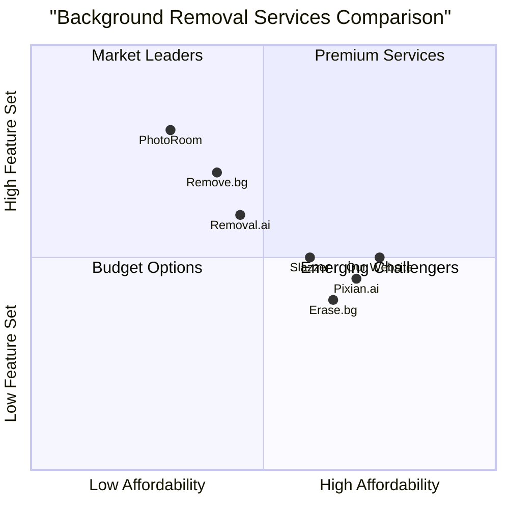

# Product Requirements Document

## Background Removal Website Modification

### Project Information
- **Project Name**: background_removal_website
- **Document Author**: Emma, Product Manager
- **Date**: March 1, 2025
- **Version**: 1.0

### Original Requirements
Modify an existing website that currently has T-shirt related content and background removal functionality to:
1. Remove all T-shirt related content from the website
2. Offer users 3 free background removals
3. After the free quota is used, users must either pay 0.7 RMB/0.1 USD per image or watch a 30-second advertisement to download the processed image

## 1. Product Definition

### 1.1 Product Goals
1. Create a focused background removal service website by removing all T-shirt related content
2. Implement a freemium model with 3 free uses followed by monetization options
3. Maximize user retention and conversion through a seamless experience and clear value proposition

### 1.2 User Stories
1. As a new user, I want to quickly understand what the website offers so that I can decide if it meets my needs.
2. As a casual user, I want to remove backgrounds from up to 3 images for free so that I can test the service before committing to payment.
3. As a regular user, I want flexible payment options after my free quota is used so that I can choose the most convenient method for my situation.
4. As a budget-conscious user, I want the option to watch advertisements instead of paying so that I can continue using the service without financial cost.
5. As a paying user, I want a simple and secure payment process so that I can quickly get back to editing my images.

### 1.3 Competitive Analysis

| Competitor | Strengths | Weaknesses |
|------------|-----------|------------|
| Remove.bg | Simple one-click removal, powerful API, plugins for various platforms | Free version limited to low-resolution images, relatively expensive subscription plans |
| PhotoRoom | Advanced AI with high accuracy for fine details, comprehensive editing tools | Higher learning curve, primarily focused on product photography |
| Slazzer | Budget-friendly pricing, good batch processing | Less intuitive interface, fewer integration options |
| Removal.ai | API integration, desktop applications | Limited free offerings |
| Erase.bg | Simple interface, prompt-based editing | Fewer advanced features |
| Pixian.ai | Transparent pay-as-you-go pricing, good mobile optimization | Newer in market, less established reputation |
| Our Website | 3 free uses, flexible monetization (pay or watch ads) | Limited to background removal only (no additional editing features) |

### 1.4 Competitive Quadrant Chart

## 2. Technical Specifications

### 2.1 Requirements Analysis

The website modification requires several key changes to transform from a T-shirt focused site with background removal functionality to a dedicated background removal service:

1. **Content Removal**: All T-shirt related content, including marketing copy, product listings, and related features must be removed.

2. **User Account System**:
   - Must track usage count for each user (authenticated and non-authenticated)
   - For non-authenticated users, track via browser storage or cookies
   - Authenticated users will have their usage tracked in their account

3. **Freemium Model Implementation**:
   - Provide 3 free background removals per user
   - Display remaining free quota prominently
   - Clear messaging when free quota is exhausted

4. **Monetization Implementation**:
   - Payment processing for 0.7 RMB/0.1 USD per image
   - Integration with payment gateways supporting both currencies
   - Ad system for showing 30-second advertisements
   - Ad completion tracking mechanism

5. **User Interface Updates**:
   - Redesign homepage to focus exclusively on background removal
   - Create new user journey flows
   - Implement quota display and monetization option selection UI

### 2.2 Requirements Pool

#### P0 (Must Have)
1. Complete removal of all T-shirt related content and functionality
2. Implementation of free quota system (3 free background removals per user)
3. Payment processing integration for post-quota usage (0.7 RMB/0.1 USD per image)
4. Implementation of 30-second advertisement viewing option
5. Background removal tool functionality maintenance during transition
6. User interface for displaying remaining free quota
7. Clear user journey for both free and paid paths
8. Mobile-responsive design

#### P1 (Should Have)
1. User account creation and login system
2. Usage history tracking for registered users
3. Email notification when free quota is running low
4. Multiple payment methods support (credit cards, digital wallets, etc.)
5. Progress indicator for advertisement viewing
6. Quick toggle between payment options (pay or watch ad)
7. Preview of processed image before download/payment

#### P2 (Nice to Have)
1. Bulk processing option with volume discount
2. Image quality options with different price points
3. Social media sharing integration
4. Browser extension for quicker access
5. Referral system (get additional free credits for referring new users)
6. Subscription option for heavy users
7. API access for developers

### 2.3 UI Design Draft

#### Homepage
- Hero section with clear value proposition: "Remove image backgrounds in seconds"
- Sample before/after examples
- Prominent upload button
- Clear indication of "3 FREE background removals" offer
- Simple how-it-works section

#### Upload Interface
- Drag-and-drop area for image upload
- Option to select from computer
- Progress indicator during upload
- Free quota remaining indicator

#### Processing Page
- Preview of original image
- Real-time background removal preview
- Fine-tuning options (if applicable)
- Download button
- Remaining free quota indicator

#### Payment/Ad Selection Page (appears after free quota exhaustion)
- Clear messaging: "You've used all your free credits"
- Two clear options presented side by side:
  - Pay 0.7 RMB/0.1 USD (with currency selection based on geolocation)
  - Watch a 30-second advertisement
- Preview of processed image with watermark

#### Advertisement Viewing Page
- Video player for advertisement
- Cannot be skipped until 30 seconds elapse
- Countdown timer clearly visible
- "Your download will be available after this ad" message

#### Payment Processing Page
- Simple form for payment details
- Currency selection option
- Secure payment indicators
- Order summary
- Terms and conditions

#### User Account Dashboard
- Usage history
- Remaining free quota indicator
- Payment history (if applicable)
- Account settings

### 2.4 Open Questions

1. **User Identification**: How will we identify returning users who haven't created an account to accurately track their free quota usage?
   - Potential solutions: Browser cookies, device fingerprinting, encourage account creation

2. **Advertisement Source**: Which ad network will be used to source the 30-second advertisements?
   - Need to evaluate options like Google AdSense, Facebook Audience Network, or direct partnerships

3. **Payment Processing**: Which payment processors can efficiently handle both RMB and USD transactions?
   - Need to research options like Stripe, PayPal, Alipay integration

4. **Geographic Pricing**: Should we implement dynamic currency detection and display based on user location?
   - Could simplify user experience but adds technical complexity

5. **Retention Strategy**: What incentives can we offer to convert ad-watching users to paying customers?
   - Consider occasional promotions or bulk purchase discounts

6. **Legal Compliance**: What privacy policy and terms of service updates are needed for the new monetization model?
   - Need legal review for ad tracking and payment processing

## 3. Implementation Plan

### 3.1 Development Phases

#### Phase 1: Content Cleanup and Basic Restructuring
- Remove all T-shirt related content
- Redesign homepage and navigation
- Maintain existing background removal functionality

#### Phase 2: Freemium Model Implementation
- Develop quota tracking system
- Implement user identification mechanism
- Create quota display UI elements

#### Phase 3: Monetization Integration
- Implement payment processing
- Integrate advertisement system
- Develop user flow between free and paid options

#### Phase 4: Testing and Optimization
- User testing of all critical paths
- Performance optimization
- A/B testing of monetization UI

### 3.2 Success Metrics

1. **User Retention**: Percentage of users who return after using free quota
2. **Conversion Rate**: Percentage of users who choose to pay or watch ads after free quota
3. **Revenue per User**: Average revenue generated per user
4. **Ad Completion Rate**: Percentage of started ads that are watched to completion
5. **User Satisfaction**: Rating system for service quality

## 4. Conclusion

This PRD outlines the transformation of an existing website with T-shirt content and background removal functionality into a focused background removal service with a freemium business model. The implementation of 3 free uses followed by paid options (0.7 RMB/0.1 USD per image) or advertisement viewing (30 seconds) provides users with flexibility while creating monetization opportunities.

By focusing exclusively on background removal and providing clear value through the initial free quota, the website can establish its utility before requesting payment or ad viewing. The dual monetization approach caters to different user preferences, potentially increasing overall conversion rates compared to a payment-only model.